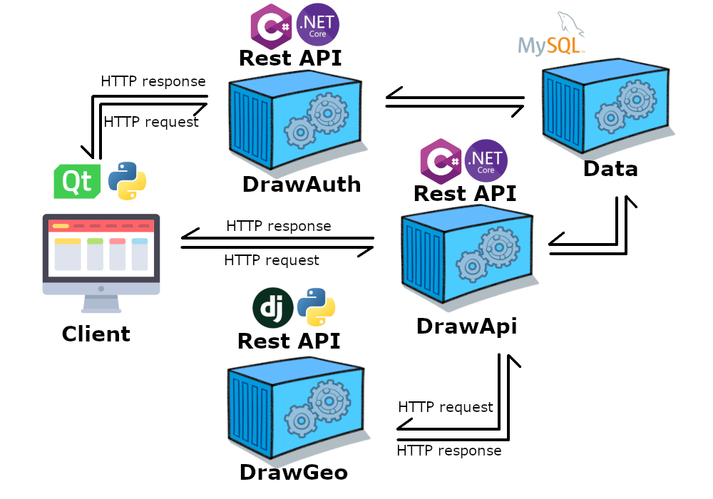
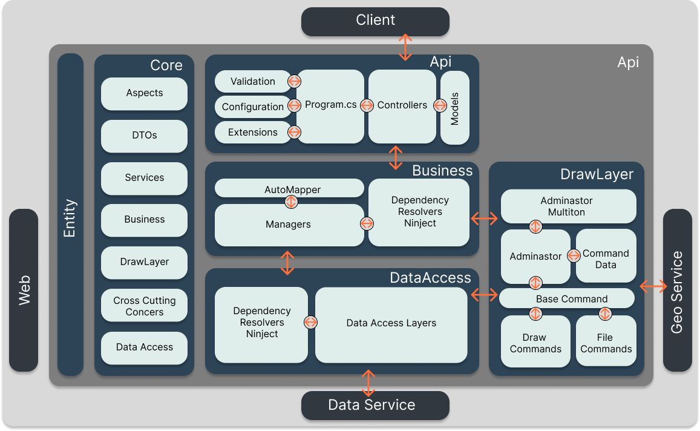
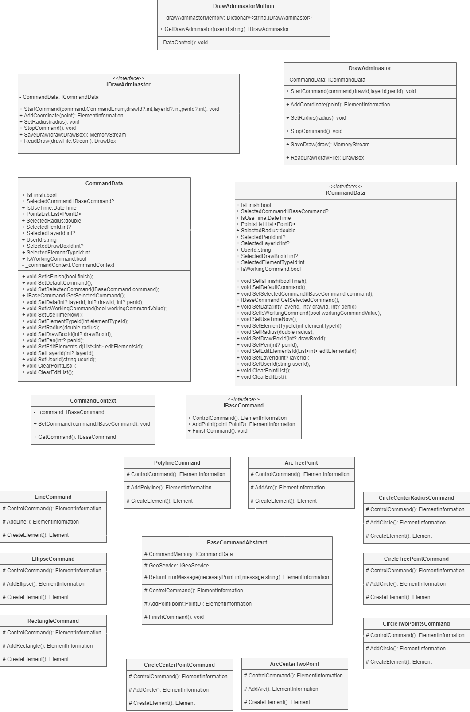

<hr>
<h6 align="center">
  <a href="https://docs.drawprogram.org">DrawCAD |</a>
  <a href="https://docs.drawprogram.org/doc">Doc |</a>
  <a href="https://docs.drawprogram.org/api">Api |</a>
  <a href="https://docs.drawprogram.org/geo">Geo |</a>
  <a href="https://docs.drawprogram.org/auth">Auth</a>
</h6>
<hr>
<h3>Quick Start</h3>

<p>API service requires mysql server, geo and auth services.
To use it, you must also start other services. You can use docker compose for this. It downloads the images of the services from dockerhub and runs them locally.</p>

```
docker-compose up -d
```

<h3>Api</h3>



<p class="mt-5">
    API service is designed to be used in CAD software. To create drawing elements such as lines, circles and arcs to organise,
     It performs the recording and recording tasks. The service, which has a layered architecture structure, is an asp.net core web api project.
     It is a Restapi type service. It supports authentication and authorization transactions. Json web token (JWT)
     It uses the name stand. To use <a style="text-decoration: none;" href="https://github.com/mzahidberber/Draw-Auth">auth</a>
     You must create a user from the Auth service. The user ID and number in the payload of the token you will create from the Auth service.
     It performs transactions using the username information. Transactions are carried out using a sigleton that matches the user's ID.
     It is done specifically for the user through classes.

    
</p>

<p>
    Technologies;
    <div style="max-width:36rem;">
        <table>
            <tbody>
                <tr>
                    <td scope="row">Data Access :</td>
                    <td>Entity Framework Core</td>
                </tr>
                <tr>
                    <td scope="row">IOC Container : </td>
                    <td>Ninject</td>
                </tr>
                <tr>
                    <td scope="row">Logging : </td>
                    <td colspan="2">NLog</td>
                </tr>
                <tr>
                    <td scope="row">Validation : </td>
                    <td colspan="2">Fluent Validation</td>
                </tr>
                <tr>
                    <td scope="row">Aspect :</td>
                    <td colspan="2">PostSharp</td>
                </tr>
                <tr>
                    <td scope="row">Map : </td>
                    <td colspan="2">AutoMapper</td>
                </tr>
                <tr>
                    <td scope="row">User transaction: </td>
                    <td colspan="2">Identity</td>
                </tr>
            </tbody>
        </table>
    </div>
</p>

<p>
    There are 11 controllers in the API layer. 10 of these controllers are tables created in the database.
     It is used to request the edits that can be made on the tables and the information held by these tables. 1 controller
     It receives requests to create drawing elements using the drawlayer layer. The format of the requests is through classes thanks to models.
     The control of the information coming with the requests is done with fluent validation technology through the created models.
     If the incoming requests comply with the required standard, they are transferred from the controller to the business layer.
     Responses to requests are in a special format
     It is given in standard format. This format contains data, status code and error properties. Depending on the status of the response
     It returns with the necessary ones of these properties.

</p>

<p>
    Requests made
     Token information should be included in the header section. Requests are made with aspects before entering the methods in the controller.
     It is checked, in case of any problem, the methods in the controller do not work and the response is accompanied by an error message.
     returns.Authentication and authorization integration is carried out in this layer with the classes in the configuration section of program.cs.
     file. In the Extensions section, any information that may occur anywhere in the service is
     Error messages of errors and errors that may occur during validation processes
     There are classes to send requests in the same format as other requests. The integration of these operations is also
     It is done in the program.cs file. The integration of nlog technology used for logging operations is also
     It is done in the program.cs file. The nlog.config file for this process is also located in this layer.
</p>


<p>If no error is encountered as a result of the checks made in the API or web layer, the transaction is transferred to the business layer.
     There are 14 managers in this layer. The interfaces of these managers are in the core layer.
     Manager instances are provided to API and web layers as singletons via interfaces with IOC container technology.
     is sent.
    
    
</p>
<h3>1. Business</h3>
<p>
    Upon requests from API and web layers in 13 managers in the business layer
     By accessing the dataaccess layer, operations such as saving, editing and deleting data are directed. Routing
     Before being processed, the data coming from the API and web layer comes in DTO classes. These classes are in automapper technology.
     It is mapped to the classes in the entity layer used in the back-end. Data transfer object (DTO) objects
     It is located in the core layer. With this process, some properties in the classes used in the back-end are removed.
     We may not send it to the client. After the mapping process is completed, we call it with an ioc container from the dataaccess layer.
     After the necessary operations are performed according to the request received by the data access layer object, the data coming from the data access layer
     It is mapped to DTO objects again and sent to the API layer in a special response format.
     .1 is for using the drawlayer layer in the manager. After performing the same map operations in this manager,
     The request is sent to the drawlayer layer. The incoming result is sent back to the API layer after the map operations are completed.


</p>

<h3>2. DataAccess</h3>

<p>
This layer contains 13 data access layer objects to call, add, update and delete data from the SQL server.
     While the concretes of the objects are kept in this layer, they can be used in other layers of the project.
     Interfaces are located in the core layer. With IOC container technology, data access layer objects
     Instances are sent via interfaces. This process brings standards to the instances with the interface.
     It facilitates integration when switching to a different technology in the future. These objects create SQL statements that will be sent to the SQL server upon request.
     There is a separate object for each table in the SQL server. Each object performs operations related to the table it is responsible for.
     Even though it does, sometimes data can be retrieved from the lower and upper tables through loading operations, depending on the requests.
     In addition, the unitofwork design pattern was used, so the operations to be performed when creating SQL statements are explained.
     It can be done all at once. If an error occurs in one of the transactions, the other transactions will be canceled.
     and we do not have to undo these operations again. In this way, these operations are carried out more efficiently.
     can be done.

    


</p>

<p>
    Entity framework core technology is used to access the Sql server. Entity framework technology
     A drawcontext class has been created by inheriting from the traditional DbContext class. In this class, dbset
     Tables were added using the models in the entity layer. With the Identity library, the tables are added to the user interface.
     Relevant tables have been added. Using the Fluent API method, the table columns
     properties have been arranged. Database connection information is obtained from the environment. With Docker
     This information is provided while the service is being restored.
</p>

<h3>3. DrawLayer</h3>

<p>
    Drawing elements can be created in the drawlayer layer, <small> drawfile (.df) </small>.
     files can be read and converted into drawing objects, and drawing objects can be converted to file format.
     The created drawing elements are not saved to the database. To save, request the element to be saved.
     should be sent.
</p>

<p>
    With multisingleton design pattern in drawlayer layer
     The operations are carried out specifically for the user, and in this layer, singledon drawadminastor objects are specific to each user.
     Which drawing element the user draws? The data he sends while drawing this element.
     It keeps information such as data in the data class and operates according to the user's wishes.
     It manages the methods.Drawadminastor objects are in the adminastormultiton class.
     in the payload of the token sent by the user
     matches the user id.
     These classes are created as soon as the user performs the first action and
     If no action is taken within 15 minutes, it is deleted.
</p>

<p>
    Drawadminastor class first starts a command while performing drawing operations. After the command starts
     The drawing element sends as many points as it needs. After sending enough points
     It creates the drawing element and returns. These operations are performed with the state design pattern.
     The type information of the drawing commands is kept in a class, and the type information of these classes can be used upon request.
     The instance is created with activator and sent to the context class in the state design pattern.
     Then, while performing operations on the initialized drawing element, the text selected from the context class
     The command is called and the necessary operations are performed.


</p>
<div align="center">
  
</div>

<h3>4. Core</h3>

<p>
    In the Core layer, there are classes used simultaneously in one or more layers.
     These classes include cross cutting concerts operations, aspects, interfaces used in other layers,
     Connections to dto classes and other services are also included in this layer.
     Postsharp technology is used for aspects. Logging is done with aspects.
     In cross cutting concerts, there are classes for logging, error catching and caching operations.


</p>