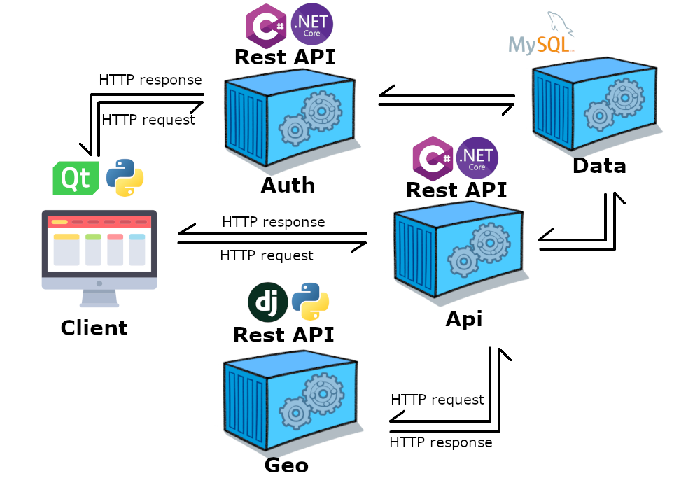

<hr>
<h6 align="center">
  <a href="https://drawprogram.org/">DrawCAD |</a>
  <a href="https://drawprogram.org/Home/DrawCAD">Doc |</a>
  <a href="https://drawprogram.org/Home/DrawApi">Api |</a>
  <a href="https://drawprogram.org/Home/DrawGeo">Geo |</a>
  <a href="https://drawprogram.org/Home/DrawAuth">Auth</a>
</h6>
<hr>
<h3>Başlangıç</h3>

<p>Api hizmeti mysql server,geo ve auth hizmetlerine ihtiyaç duyar.
Kullanmak için diğer servisleride başlatmalısınız.Bunun için docker compose kullanabilirsiniz.Hizmetlerin imagelerini dockerhubtan indirir ve localde çalıştırır.</p>

```
docker-compose up -d
```

<h3>Api</h3>


<p class="mt-5">
    Api hizmeti cad yazılımlarında kullanmak için tasarlanmıştır.Çizgi,çember,yay gibi çizim elemanlarını oluşturmak
    ,düzenlemek
    ve kaydetme işlerini yapmaktadır.Katmanlı mimari yapısında olan hizmet asp.net core web api projesidir.
    Restapi türünde bir hizmettir.Authentication ve authorization işlemlerini destekler.Json web token (JWT) 
    standadını kullanır.Kullanmak için <a style="text-decoration: none;" href="https://github.com/mzahidberber/Draw-Auth">auth</a> 
    hizmetinden kullanıcı oluşturmalısınız.Auth hizmetinden oluşturacağınız tokenin payloadındaki kullanıcı id ve 
    kullanıcı adı bilgilerini kullanarak işlemleri gerçekleştirir.İşlemler kullanıcının id si ile eşleşen sigleton
    sınıflar üzerinden kullanıcıya özel olarak yapılır.

    
</p>

<p>
    Projede;
    <div style="max-width:36rem;">
        <table>
            <tbody>
                <tr>
                    <td scope="row">Data Erişim :</td>
                    <td>Entity Framework Core</td>
                </tr>
                <tr>
                    <td scope="row">IOC Container : </td>
                    <td>Ninject</td>
                </tr>
                <tr>
                    <td scope="row">Loglama : </td>
                    <td colspan="2">NLog</td>
                </tr>
                <tr>
                    <td scope="row">Validation : </td>
                    <td colspan="2">Fluent Validation</td>
                </tr>
                <tr>
                    <td scope="row">Aspect :</td>
                    <td colspan="2">PostSharp</td>
                </tr>
                <tr>
                    <td scope="row">Map : </td>
                    <td colspan="2">AutoMapper</td>
                </tr>
                <tr>
                    <td scope="row">Kullanıcı İşlemleri : </td>
                    <td colspan="2">Identity</td>
                </tr>
            </tbody>
        </table>
    </div>
    teknolojileri kullanılmıştır.
</p>

<p>
    Api katmanında 11 adet controller bulunmaktadır.Bu controllerların 10 tanesi databasede oluşturulan tablolar
    üzerinde yapılabilecek düzenlemeler ve bu tabloların tuttuğu bilgileri istemek için kullanılır.1 adet controller
    ise drawlayer katmanını kullanarak çizim elemanları oluşturmak için istek alır.İsteklerin formatı modeller sayesinde sınıflar üzerinden
    belirlenir.İstekler ile gelen bilgilerin kontrolü oluşturulan modeller üzerinden fluent validation teknoloji ile yapılır.
    Gelen istekler istenen standarta uygunsa controllerdan business katmanına aktarılırlar.
    Yapılan isteklere verilen yanıtlar özel bir formatta
    standart şekilde verilmektedir.Bu formatta data,status code ve error propertyleri bulunmaktadır.Yanıtın durumuna göre
    bu propertylerden gerekli olanlar dolu bir şekilde döner.

</p>

<p>
    Yapılan isteklerin
    header kısmında token bilgisi yer almalıdır.İstekler controllerdaki methodlara girmeden önce aspectler ile
    kontrol edilir herhangi bir sorunda controllerdaki methodlar çalışmadan geriye yanıt hata mesajı ile birlikte
    döner.Authentication ve authorization entegrasyonu bu katmanda configuration bölümündeki sınıflarla program.cs
    dosyasında yapılmaktadır.Extensions bölümünde hizmetin herhangi bir yerinde oluşabilecek
    hataların hata mesajlarını ve validation işlemlerinde oluşabilecek hataların
    diğer isteklerle aynı formatta gönderebilmek için sınıflar bulunmaktadır.Bu işlemlerin entegrasyonu yine
    program.cs dosyasında yapılmaktadır.Loglama işlemleri için kullanılan nlog teknolojisinin entegrasyonuda yine
    program.cs dosyasında yapılmaktadır.Bu işlem için nlog.config dosyasıda bu katmanda bulunmaktadır.
</p>


<p>Api veya web katmanında yapılan kontroller sonucunda bir hata ile karşılaşılmazsa işlem business katmanına
    yönlendirilir.Bu katmanda 14 adet manager bulunmaktadır.Bu managerların interfaceları core katmanındadır.
    IOC container teknoloji ile interfaceler üzerinden singleton olarak api ve web katmanlarına manager instanceleri
    gönderilir.
    
    
</p>
<h3>1. Business</h3>
<p>
    Business katmanındaki 13 adet managerda api ve web katmanlarından gelen istekler üzerine
    dataaccess katmanına erişip verileri kaydetme ,düzenleme ve silme gibi işlemler yönlendirilir.Yönlendirme
    yapılamadan önce api ve web katmanından gelen veriler DTO sınıflarında gelir bu sınıflar automapper teknolojisi
    ile back-end'te kullanılan entity katmanında bulunan sınıflara map edilir.Data transfer object (DTO) nesneleri
    core katmanında bulunmaktadır.Bu işlem ile back-end te kullanılan sınıflardaki bazı properyleri
    clientta göndermeyebiliyoruz.Mapleme işlemi bittikten sonra dataaccess katmanından ioc container ile çağırdığımız
    data access layer objesi ile gelen isteğe göre gerekli işlemler yapıldıktan sonra dataacces katmanından gelen veriler
    yeniden DTO objelerine map edilip api katmanına özel response formatında gönderilmektedir
    .1 adet managerda drawlayer katmanını kullanmak içindir.Bu managerdada yine aynı map işlemleri yapıldıktan sonra
    istek drawlayer katmanına gönderilir.Gelen sonucu yine map işlemleri bittikten sonra api katmanına geri gönderilir.


</p>

<h3>2. DataAccess</h3>

<p>
Bu katman sql serverdan veri çağırmak,eklemek,güncellemek ve silmek için 13 adet data access layer objeleri
    bulunmaktadır.Objelerin concreteleri bu katmanda tutulurken projenin başka katmanlarındada kullanabilmek için
    interfacedeleri core katmanında bulunmaktadır.IOC container teknolojisi ile data access layer objelerinin 
    interfaceleri üzerinden instanceleri gönderilmektedir.Bu işlem interface ile instancelere standartlar getirerek
    ilerde farklı bir teknolojiye geçildiğinde entegrasyonu kolaylaştırmaktadır.Bu objeler yapılan isteğe göre sql servera gönderilecek olan sql cümleciklerini oluşturmaktır.
    Her sql serverdaki tablo için ayrı obje bulunmaktadır.Her obje sorumlu olduğu tablo ile ilgili işlemleri
    yapsada bazen isteklere göre alt ve üst tablolaradan loading işlemleri ile verilerde çekilebilmektedir.
    Ayrıca unitofwork tasarım deseni kullanılmıştır bu sayede sql cümlecikleri oluşturulurken yapılacak işlemler
    tek seferde yapılabilmektedir.Yapılacak işlemlerin birisinde hata meydana geldiğinden diğer işlemlerde iptal
    olmakta ve tekrar bu işlemleri geri almak zorunda kalmıyoruz.Bu sayede bu işlemler daha performanslı şekilde
    yapılabilmektedir.

    


</p>

<p>
    Sql servera ulaşabilmek için entity framework core teknoloji kullanılmaktadır.Entity framework teknolojisinden
    gelene DbContext sınıfından miras alınarak bir drawcontext sınıfı oluşturulmuştur.Bu sınıfta dbset ile 
    entity katmanındaki modeller kullanılarak tablolar eklenmiştir.Identity kütüphanesi ile de kullanıcı ile 
    ilgili olan tablolar eklenmiştir.Fluent api yöntemi ile tablo kolonlarının
    özellikleri düzenlemiş.Database bağlantı bilgilerini environmentten almaktadır.Docker ile 
    hizmet ayağa kaldırılırken bu bilgiler verilmektedir.
</p>

<h3>3. DrawLayer</h3>

<p>Drawlayer katmanında çizim elemanları oluşturulabilmekte, <small>drawfile (.df)</small>
    dosyaları okunup çizim nesnelerine dönüştürülebilmekte ve çizim nesneleri dosya formatın dönüştürülebilmektedir.
    Oluşturulan çizim elemanları databaseye kaydedilmemektetir.Kaydetmek için kaydedilecek eleman ile ilgili istek
    gönderilmelidir.
    
    
</p>

<p>
    Drawlayer katmanında multisingleton tasarım deseni ile
    işlemler kullanıcıya özel yapılmakta ve bu katmanda her kullanıcıya özel singledon drawadminastor nesnelerinde
    kullanıcının hangi çizim elemanını çizdiğini bu elemanı çizerken gönderdiği verileri
    gibi bilgileri data sınıfında tutar ve kullanıcının isteklerine göre çalışacak bünyesinde bulundurduğu
    methodları yönetmektedir.Drawadminastor nesneleri adminastormultiton sınıfında
    kullanıcının gönderdiği tokenin payloadındaki
    kullanıcı idsi ile eşleşmektedir.
    Kullanıcı ilk işlemi yaptığı anda bu sınıflar oluşturulmakta ve 
    15 dakika içerisinde herhangi bir işlem yapmazsa silinmektedir.
</p>

<p>
    Drawadminastor sınıfı çizim işlemlerini yaparken öncelikle bir komut başlatır.Komut başladıktan sonra
    çizim elemanı ne kadar ihtiyaç duyuyorsa o kadar nokta gönderir.Yeterince nokta gönderdikten sonra
    çizim elemanını oluşturur ve geriye döner.Bu işlemler state tasarım deseniyle yapmaktadır.
    Çizim komutların type bilgileri bir sınıfta tutulmakta gelen isteğe göre bu sınıfların tip bilgilerinden
    activator ile instancesi oluşturulup state tasarım desenindeki context sınıfına gönderimektedir.
    Daha sonra başlatılan çizim elemanı üzerinde işlemler yapılırken context sınıfından seçilen 
    komut çağırılıp gerekli işlemler yapılmaktadır.


</p>
<div align="center">
  
</div>

<h3>4. Core</h3>

<p>
    Core katmanında bir veya birden fazla katmanda aynı anda kullanılan sınıflar bulunmaktadır.
    Bu sınıflar cross cutting concers işlemleri,aspectler,diğer katmanlarda kullanılan interfaceler,
    dto sınıfları ve diğer hizmetlerle olan bağlantılarda yine bunu katmanda yer almaktadır.
    Aspectler için postsharp teknolojisi kullanılmıştır.Aspectler ile loglama işlemleri yapılmaktadır.
    Cross cutting concerste ise loglama,hata yakalama ve cacheleme işlemleri için sınıflar bulunmaktadır.


</p>